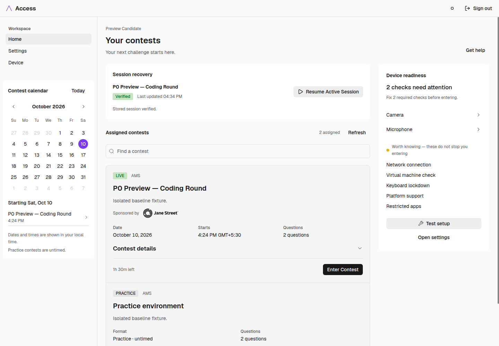
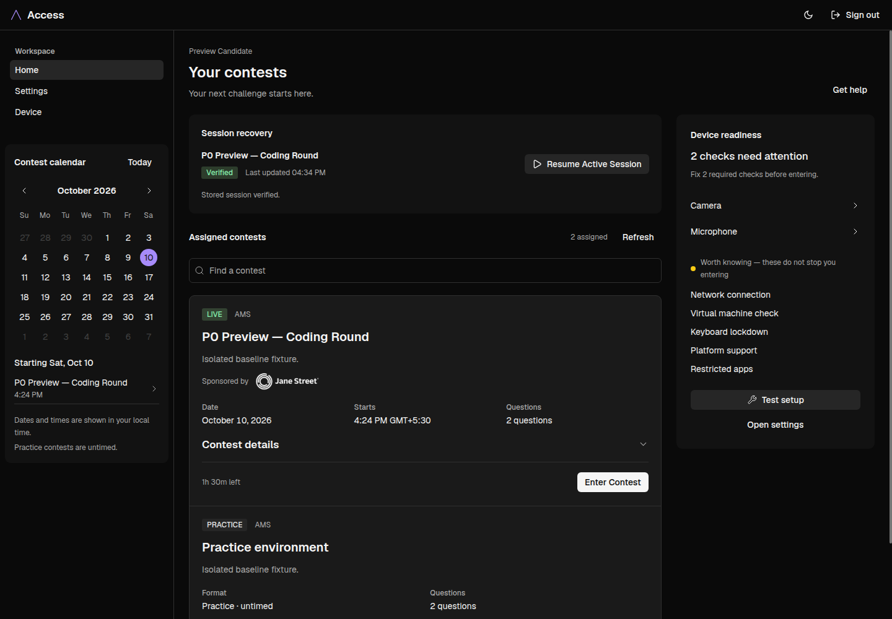
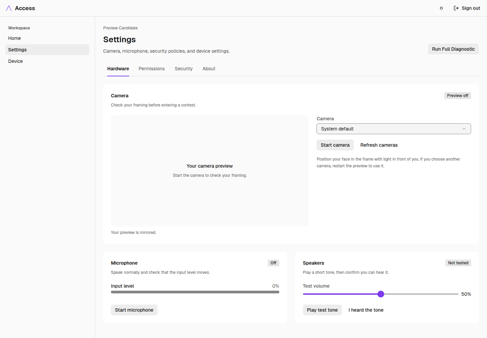
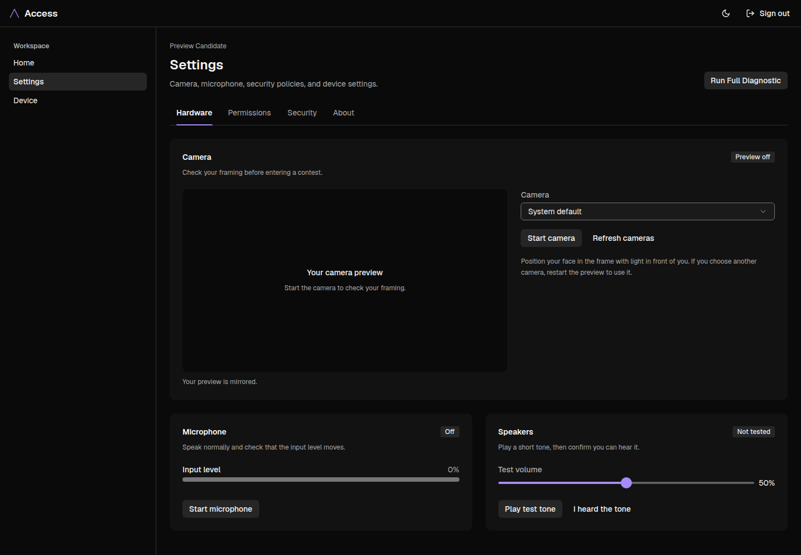
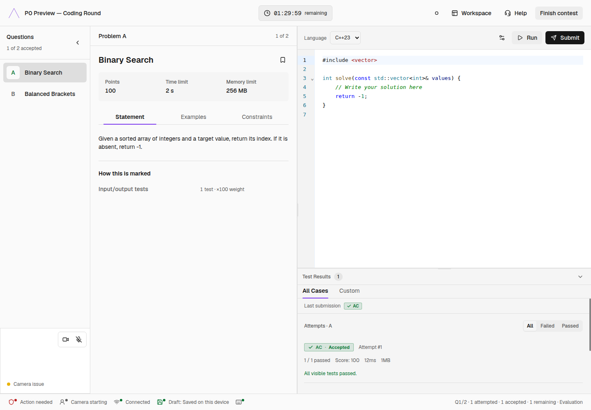
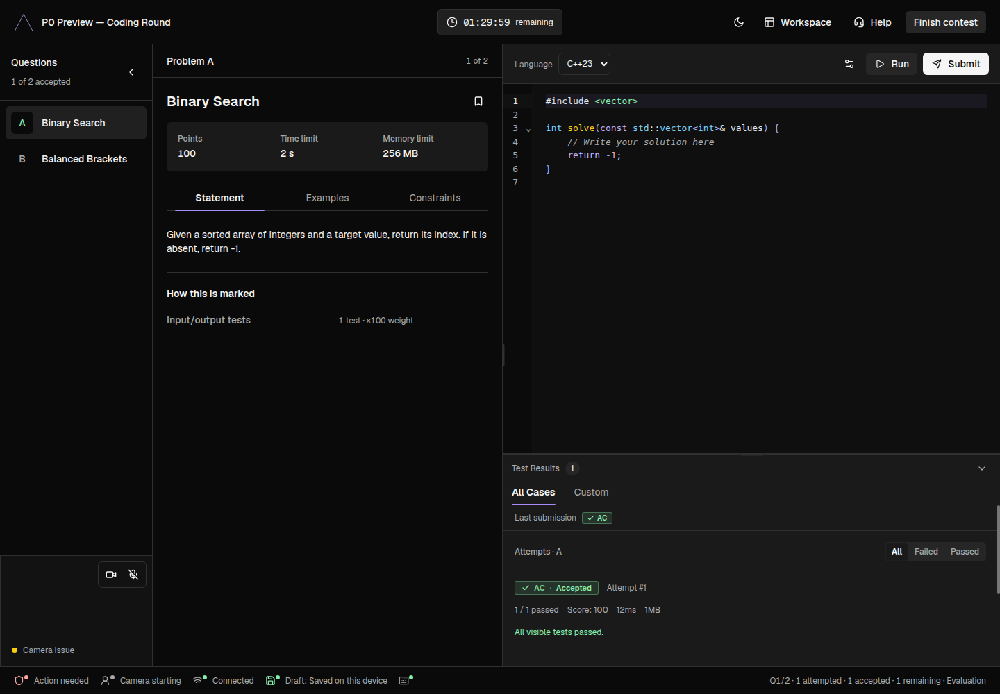

# AccessSoftware UI design reference

Reviewed 10 October 2026. This document describes the current AccessSoftware candidate application: its dashboard, settings, device diagnostics, contest workspace, onboarding, sign-in, welcome, and submissions pages in **light and dark mode**. It records implemented behavior, with differences between declared design intent and rendered behavior called out explicitly.

## 1. Review baseline and evidence

The source repository is `Algorithms-Mathematics-Society/ams-access`, under `/home/user/AccessSoftware`. Its original `ams-access` checkout is detached at `7146743`; its separate `ams-access-main` worktree tracks `main`. Before this review, `git pull --ff-only` updated the main worktree from `1b0d5f7` to **`5136862`**, matching `origin/main`. The existing `.gitignore` edit was preserved. The detached checkout and backup worktree were not changed.

All current implementation references below refer to `/home/user/AccessSoftware/ams-access-main`, at that commit. This is a different repository from the surrounding `AMS Access` web project. The older [access_design.md](access_design.md) describes a darker, more decorative web direction; it is not an accurate specification of the current AccessSoftware candidate UI.

The review combined source inspection with a local Next.js preview and **26 browser captures**: 12 screens/states in each theme at 1440 × 1000, plus dashboard and contest at 900 × 900 in light mode. Screenshots and measured fonts, colors, radii, and dimensions are saved in [docs/design-update](docs/design-update/); [manifest.json](docs/design-update/manifest.json) records the capture context. The final capture run reported no capture failures or uncaught browser exceptions. Captured document widths did not exceed their viewports; this is not a full audit of every internal scroll region or every screen size.

The preview used the repository's browser-only fixture data in a disposable Chrome profile, with external HTTP requests blocked. Contest names, attempts, session recovery, and timestamps in screenshots are demonstration data. Native Tauri checks, actual camera/microphone streams, OS permission prompts, lockdown, and judging were not validated. Missing native checks intentionally appear unavailable or advisory. Some conditional states below were inspected in source rather than triggered in the browser.

### Recent changes that affect the design

| Updated behavior                                   | Design consequence                                                                                                             |
| -------------------------------------------------- | ------------------------------------------------------------------------------------------------------------------------------ |
| Session routes respect the app theme               | Onboarding and contest now support light mode; the active dark-lock route list is empty.                                       |
| Light-mode status colors were clarified            | Use the current semantic text colors and stronger selected-question background.                                                |
| Contest question navigation was simplified         | Compact question rows, clear active selection, accepted/review coloring, and separate bookmarks.                               |
| Output was reorganized                             | Current tabs are **All Cases** and **Custom** under **Test Results**. Older descriptions of a separate Attempts tab are stale. |
| Workspace resizing and recovery notices changed    | Split panes resize without competing width transitions; recovered-draft notices can be dismissed.                              |
| Camera preview controls were added                 | Camera/microphone controls and preview visibility are distinct interactions.                                                   |
| Device checks report independently                 | Settings and diagnostics must represent partial, unavailable, advisory, and failed checks separately.                          |
| Media permission and macOS recovery updates landed | Platform-dependent recovery and permission guidance are part of the current settings/setup experience.                         |

## 2. Visual character

AccessSoftware is a restrained assessment workspace. Its visual hierarchy comes from **neutral surface steps, compact type, thin separators, and deliberate spacing**. Purple identifies the brand and selected controls; green, amber, and red communicate state.

The dashboard feels spacious around its columns but economical within controls. Settings use broad, quiet groups. The contest screen is denser: a full-window tool with adjoining panes and internal scrolling. These are three compositions of the same visual system.

The current UI has:

- Near-white or near-black canvas, with solid neutral surfaces above it.
- Mostly flat panels; ordinary settings/readiness cards have no visible border or shadow.
- One-pixel borders where boundaries matter: navigation, contest panes, inputs, list frames, and row dividers.
- Modest corners: 3px, 6px, and 9px are the main shape vocabulary.
- Black/near-white primary buttons, depending on theme.
- Purple marks, selected-tab underlines, calendar selection, sliders, and focus treatment.
- Small status tokens and dots, paired with readable labels.
- Outline icons and an open triangular Access mark.

Large glows, glass panels, gradient headings, oversized pill cards, and purple-filled page regions are not the defining patterns of the reviewed screens.

## 3. Libraries and component architecture

Versions below are installed versions used for the local preview, not claims about the latest available releases.

| Layer                       | Actual implementation                            | Design role                                                                                                     |
| --------------------------- | ------------------------------------------------ | --------------------------------------------------------------------------------------------------------------- |
| Application                 | Next.js 15.5.16, React 19.2.6, TypeScript        | App Router pages; static export for the desktop shell.                                                          |
| Desktop                     | Tauri shell with Rust/native services            | Hosts the web UI and supplies device/security behavior.                                                         |
| Component system            | `@astryxdesign/core` **0.1.8**                   | Layout, navigation, controls, typography, cards, status, and dialogs.                                           |
| Theme foundation            | `@astryxdesign/theme-neutral` **0.1.8**          | Extended by the custom Access theme.                                                                            |
| Fonts                       | `geist` 1.7.2                                    | Geist Sans for interface text; Geist Mono for theme code roles.                                                 |
| Icons                       | `lucide-react` 1.17.0, Astryx `Icon`, custom SVG | Thin line icons; small triangular brand mark.                                                                   |
| Existing CSS infrastructure | Tailwind CSS 4.2.4 and global/scoped CSS         | Compatibility utilities and remaining page rules. New Astryx composition should use component props and tokens. |
| Editor                      | CodeMirror 6; `@codemirror/view` 6.43.0          | Code editing, line numbers, diagnostics, syntax colors, preferences.                                            |
| Statement rendering         | Marked 18.0.4, DOMPurify 3.4.9, KaTeX 0.16.47    | Sanitized problem content, examples, tables, and mathematical notation.                                         |
| Motion                      | Framer Motion 11.18.2 plus CSS transitions       | Limited transitions, including draft-recovery dismissal.                                                        |

**Astryx is the primary UI library.** The `monaco-dark` and `monaco-light` editor theme IDs do not mean Monaco Editor is used; these are CodeMirror theme presets named after VS Code appearances.

Common building blocks:

| Purpose       | Components already used                                                                                     |
| ------------- | ----------------------------------------------------------------------------------------------------------- |
| Page frame    | `AppShell`, `Layout`, `LayoutPanel`, `LayoutContent`, `TopNav`, `TopNavHeading`                             |
| Navigation    | `SideNav`, `SideNavItem`, `SideNavSection`, `TabList`, `Tab`                                                |
| Layout        | `HStack`, `VStack`, `Grid`, `AspectRatio`, `Section`, `Divider`                                             |
| Text          | `Heading`, `Text`, `MetadataList`, `MetadataListItem`, `CodeBlock`                                          |
| Controls      | `Button`, `IconButton`, `TextInput`, `Selector`, `Slider`, `Switch`, `SegmentedControl`                     |
| Grouping/data | `Card`, `List`, `ListItem`, `Collapsible`, `Calendar`                                                       |
| Feedback      | `Token`, `StatusDot`, `Badge`, `Banner`, `Skeleton`, `Spinner`, `EmptyState`                                |
| Overlays      | Astryx `Dialog` through `AccessDialog`; a separate `ContestOverlay` for contest priority/focus requirements |

`@ams/shared-ui` re-exports Astryx primitives; it does not introduce a second theme or palette. Some legacy components and raw elements remain in source. Treat the mounted Astryx compositions as the current reference, rather than copying every older export in a file.

Sources: [package manifest][packages], [shared UI boundary][shared], [repository instructions][agents].

## 4. Theme system: one palette, two modes

### Canonical source and generation

`apps/web/src/theme/accessTheme.ts` defines the Access theme, extending `neutralTheme`. Token pairs are ordered **[light, dark]**. Edit this source when changing the palette; run `pnpm theme:build` to regenerate its outputs.

| File                              | Responsibility                                                                              |
| --------------------------------- | ------------------------------------------------------------------------------------------- |
| `accessTheme.ts`                  | Canonical colors, typography, radius, motion, and component variants.                       |
| `accessTheme.css`                 | Generated scoped Astryx theme, including `light-dark()` values.                             |
| `access.js` and declaration files | Generated runtime theme and typings.                                                        |
| `fallback.css`                    | Generated explicit light/dark values for WebViews without the required modern CSS features. |
| `compatibility.css`               | Generated legacy accent RGB aliases.                                                        |
| `globals.css`                     | Imports, CSS layers, legacy token aliases, focus behavior, and page-specific rules.         |

The import order is Tailwind, Astryx reset, Astryx component CSS, fallback, generated Access CSS, and compatibility CSS. Explicit layers order reset/base styles below Astryx and page/component rules.

The fallback file contains inherited defaults followed by Access overrides. Its first radius or color declaration is therefore not necessarily the effective Access value. Verify the final generated token or computed style.

### Preference and rendering behavior

- `ams_theme` stores the explicit `light` or `dark` preference.
- A valid saved preference wins; otherwise the app follows the system preference.
- System changes are followed while there is no explicit saved preference. The current toggle exposes two modes, not a separate “System” option.
- A pre-paint script applies the root class and theme attributes before page content.
- `<html>` receives `data-astryx-theme="access"` and `data-theme="light|dark"`; `AccessThemeProvider` supplies the matching Astryx theme.
- `DARK_LOCKED_ROUTES` is currently `[]`. Older route-lock comments and historical migration documents do not establish a current dark-only contest policy.
- The toggle has a destination label such as “Switch to dark theme.” Its light-mode symbol is a simple outlined circle; dark mode uses a crescent.
- Portal/native-control color schemes must stay aligned with the root preference.

Sources: [theme definition][theme], [generator][generator], [root layout][layout], [preference store][theme-store], [route policy][dark-lock], [theme provider][provider], [theme toggle][toggle].

## 5. Color specification

Hex values below are reference values from the reviewed source. Implementation should use the token names, not copied literals.

### Neutral surfaces, text, and boundaries

| Token                         | Light       | Dark        | Main use                                                         |
| ----------------------------- | ----------- | ----------- | ---------------------------------------------------------------- |
| `--color-background-body`     | `#fafafa`   | `#0a0a0a`   | Dashboard canvas; contest frame and reading pane.                |
| `--color-background-card`     | `#ffffff`   | `#121212`   | Settings, calendar, readiness, recovery groups.                  |
| `--color-background-surface`  | `#f5f5f5`   | `#1a1a1a`   | Contest-list frame, editor chrome, output, some page shells.     |
| `--color-background-popover`  | `#ffffff`   | `#1a1a1a`   | Theme role for raised controls; actual popovers may use `Card`.  |
| `--color-background-muted`    | `#eeeeee`   | `#202020`   | Quiet inset regions, timer, summary blocks.                      |
| `--color-background-inverted` | `#171717`   | `#f5f5f5`   | Primary-button fill.                                             |
| `--color-text-primary`        | `#171717`   | `#f5f5f5`   | Headings, values, main labels.                                   |
| `--color-text-secondary`      | `#5b5b5b`   | `#aaaaaa`   | Descriptions, timestamps, secondary labels.                      |
| `--color-text-disabled`       | `#777777`   | `#777777`   | Disabled text role.                                              |
| `--color-border`              | `#dedede`   | `#303030`   | Standard frames and dividers.                                    |
| `--color-border-emphasized`   | `#858585`   | `#767676`   | Stronger input/focus boundaries and scrollbar thumb.             |
| `--color-neutral`             | `#ededed`   | `#262626`   | Secondary buttons and neutral controls.                          |
| `--color-track`               | `#b8b8b8`   | `#606060`   | Track role.                                                      |
| `--color-skeleton`            | `#dedede`   | `#303030`   | Loading placeholders.                                            |
| `--color-overlay-hover`       | `#0000000a` | `#ffffff0a` | Approximately 4% neutral hover wash.                             |
| `--color-overlay-pressed`     | `#00000014` | `#ffffff14` | Approximately 8% pressed wash.                                   |
| `--color-overlay`             | `#00000066` | `#000000b3` | General overlay role; contest overlays use a separate treatment. |

Primary and secondary icon tokens mirror their corresponding text colors. Light mode uses dark neutral text on pale surfaces; dark mode uses near-white and gray text on black/charcoal surfaces. The composition and hierarchy remain the same.

Not every page canvas uses `background-body`: shell variants can use a surface background, as visible on onboarding and submissions. Preserve the role of a surface within its composition instead of flattening every light background to white or every dark background to black.

### Brand/accent

| Token                                                | Light       | Dark        |
| ---------------------------------------------------- | ----------- | ----------- |
| `--color-accent`                                     | `#7c3aed`   | `#a78bfa`   |
| `--color-text-accent` / `--color-text-purple`        | `#6d28d9`   | `#c4b5fd`   |
| `--color-icon-accent` / `--color-icon-purple`        | `#6d28d9`   | `#c4b5fd`   |
| `--color-on-accent`                                  | `#ffffff`   | `#171717`   |
| `--color-accent-muted` / `--color-background-purple` | `#7c3aed14` | `#a78bfa14` |
| `--color-border-purple`                              | `#7c3aed`   | `#a78bfa`   |

Purple is visible in the Access mark, active-tab underline, selected calendar date, slider, focus ring, and temporary contest-row highlight. Side navigation and selected question rows use neutral fills rather than full purple backgrounds.

The theme defines a purple `variant:submit` button. **The current editor Submit button uses `variant="primary"`**, so it is neutral in the captured UI. Do not describe the unused purple variant as the current rendered Submit style.

### Semantic status colors

| Role                                                   | Light                 | Dark                  |
| ------------------------------------------------------ | --------------------- | --------------------- |
| Success signal `--color-success`                       | `#15803d`             | `#4ade80`             |
| Success text `--color-text-green`                      | `#00722f`             | `#86efac`             |
| Success wash `--color-success-muted`                   | `#15803d14`           | `#4ade8014`           |
| Success border `--color-border-green`                  | `#15803d80`           | `#4ade8080`           |
| Warning signal `--color-warning`                       | `#946800`             | `#fbbf24`             |
| Warning text `--color-text-yellow`                     | `#785400`             | `#fcd34d`             |
| Warning dot/icon `--color-icon-yellow`                 | `#eab308`             | `#facc15`             |
| Warning wash `--color-warning-muted`                   | `#fff6de`             | `#fbbf2414`           |
| Warning border `--color-border-yellow`                 | `#94680080`           | `#fbbf2480`           |
| Error signal/text `--color-error` / `--color-text-red` | `#b91c1c` / `#b91c1c` | `#f87171` / `#fca5a5` |
| Error wash `--color-error-muted`                       | `#b91c1c14`           | `#f8717114`           |
| Error border `--color-border-red`                      | `#b91c1c80`           | `#f8717180`           |

`Token` color families also inherit distinct background tokens from Astryx neutral. They are not interchangeable with the semantic `*-muted` washes:

| Token background            | Light     | Dark                          |
| --------------------------- | --------- | ----------------------------- |
| `--color-background-green`  | `#c5e5c0` | `#84c9803d`                   |
| `--color-background-yellow` | `#f8da9d` | `#deb4333d`                   |
| `--color-background-red`    | `#facecb` | `#ff9e973d`                   |
| `--color-background-gray`   | `#e5e5e5` | `--color-neutral` = `#262626` |

This is why a green LIVE token can be more visibly filled than a muted success banner. Use the component's semantic API rather than approximating it with arbitrary opacity.

Source: [canonical theme][theme], [compiled values][compiled], [global aliases and overrides][globals].

## 6. Borders, corners, shadows, and spacing

### Shape scale

The custom theme uses `radius: { base: 3, multiplier: 1 }`.

| Token                | Effective value | Usage                                                                        |
| -------------------- | --------------- | ---------------------------------------------------------------------------- |
| `--radius-none`      | 0px             | Adjoining workspace panes and square regions.                                |
| `--radius-inner`     | 3px             | Small details and scrollbar thumb.                                           |
| `--radius-element`   | 6px             | Buttons, inputs, question-letter tiles, code labels, compact control groups. |
| `--radius-container` | 9px             | Settings/readiness/calendar groups, contest-list frame, overlays.            |
| `--radius-page`      | 21px            | Available larger-scale shape; not a mandate to round the app frame.          |
| `--radius-full`      | 9999px          | Fully rounded shapes where required; calendar dates use circular geometry.   |

Legacy aliases resolve `--radius-sm` → inner, `--radius-md` → element, `--radius-lg` → container, and `--radius-pill` → full. Their names should not be read as Tailwind defaults.

Ordinary boundaries use `var(--border-width) solid var(--color-border)`; the measured border-width token is **1px**. Borderless settings groups are intentional. Their separation comes from background contrast and whitespace. The contest workspace instead uses straight adjoining panes, with thin separators and no rounded outer card around every region.

### Elevation

| Token           | Geometry      | Light shadow | Dark shadow |
| --------------- | ------------- | ------------ | ----------- |
| `--shadow-low`  | `0 1px 3px`   | `#0000000d`  | `#00000040` |
| `--shadow-med`  | `0 4px 16px`  | `#00000012`  | `#00000059` |
| `--shadow-high` | `0 16px 48px` | `#00000024`  | `#00000080` |

Inset interaction shadows use a 2px stroke with emphasized, accent, or semantic border colors. Availability does not imply universal application: captured calendar and hardware cards have **no box shadow**. The editor-preferences popover and contest overlays use `shadow-high`.

### Spacing and control sizes

The spacing unit is **4px**, with half steps where needed.

| Token suffix | 0.5 | 1   | 1.5 | 2   | 3   | 4   | 5   | 6   | 8   | 10  | 11  | 12  |
| ------------ | --- | --- | --- | --- | --- | --- | --- | --- | --- | --- | --- | --- |
| Pixels       | 2   | 4   | 6   | 8   | 12  | 16  | 20  | 24  | 32  | 40  | 44  | 48  |

Common relationships:

- 4–8px between a label and its detail or between tightly related controls.
- 12–16px within rows, toolbars, and metadata groups.
- 20px contest-row inset.
- 24px between dashboard columns and settings groups.
- Dashboard content gutters clamp between 16px and 24px.
- Settings cards use `padding={6}`; the measured CSS padding is 23px because the Astryx card calculation compensates for a border even when the page overrides that border to zero. Preserve the component prop, rather than introducing a new 23px spacing token.
- Element size tokens are `--size-element-sm/md/lg` = **28/32/36px**. Standard primary/secondary buttons measured 32px high, with 6px corners and 14px labels. Several deliberate controls exceed these defaults: search is at least 40px; welcome/setup CTAs are at least 44px.

Sources: [compiled theme][compiled], [fallback and defaults][fallback], [dashboard shell][dashboard], [settings composition][settings].

## 7. Typography and iconography

### Fonts and hierarchy

The canonical UI family is **Geist Sans**, loaded through `geist/font/sans`. The browser confirmed Geist Sans loaded. Theme code/monospace roles use **Geist Mono** through `geist/font/mono`.

The CodeMirror content is an explicit exception: it declares **`'JetBrains Mono', 'Fira Code', monospace`**. The capture records that computed stack but does not prove either named editor font was downloaded; the browser may use its monospace fallback.

| Role / token                                    | Size | Typical treatment                                                                                          |
| ----------------------------------------------- | ---- | ---------------------------------------------------------------------------------------------------------- |
| Supporting / `--font-size-xs`, `--font-size-sm` | 12px | Secondary labels, helper text, timestamps; approximately 20px supporting line height.                      |
| Body / `--font-size-base`                       | 14px | Main copy and control labels; approximately 20px line height.                                              |
| Large / `--font-size-lg`                        | 17px | Prominent supporting text or compact section emphasis.                                                     |
| Heading 2 / `--font-size-xl`                    | 20px | Contest titles/problem titles.                                                                             |
| Heading 1 / `--font-size-2xl`                   | 24px | Measured dashboard, settings, sign-in, and submissions titles; 600 weight, approximately 32px line height. |
| `--font-size-3xl`                               | 29px | Smaller display step.                                                                                      |
| Display 2 / `--font-size-4xl`                   | 35px | Available display role.                                                                                    |
| Display 1 / `--font-size-5xl`                   | 42px | Welcome and onboarding hero at the reviewed desktop width.                                                 |
| CodeMirror default                              | 13px | User-adjustable from 12px through 20px; wrapping enabled by default.                                       |

The theme declares a 14px base with a 1.2 scale ratio. The root body itself measured 16px; Astryx text roles establish the smaller interface scale. Do not infer all content sizes from the body element.

The dashboard source requests `display-2` on its overview heading, but the reviewed browser resolves “Your contests” to **24px**, not 35px. For fidelity, use the screenshot/computed size as the current baseline and verify the Astryx heading cascade before changing that behavior.

Weights are restrained: 400 body/supporting, 500 controls/labels, and 600 headings. Timers and selected metadata use tabular numbers to prevent movement as values change. Uppercase labels occur selectively, such as the welcome eyebrow and compact status tokens; normal titles and descriptions are sentence case.

### Icons and mark

The brand is an open triangular outline plus the word “Access.” Dashboard and contest headers use compact versions; purple is concentrated in the mark. Interface icons are mainly 14–16px outline glyphs. Their color follows the surrounding text or a semantic state. Icon-only controls retain accessible labels and, where supplied, tooltips.

The visual priority is title → relevant state/value → supporting explanation → action. Avoid using decorative badges or icons as substitutes for this hierarchy.

Sources: [theme][theme], [root font loading][layout], [editor themes][editor], [capture measurements](docs/design-update/manifest.json).

## 8. Dashboard: `/home`

### Frame and navigation

The dashboard uses Astryx `AppShell` with `variant="section"`, full height, no default content padding, and an explicit body background.

```text
┌ Access ─────────────────────────────────────────── Theme · Sign out ┐
│ Workspace: 280px │ Candidate name · Your contests · Help             │
│ Home            │                                                    │
│ Settings        │ Main column (fluid)      │ Readiness (~320px basis)│
│ Device          │ Session recovery        │ Summary and check rows  │
│                 │ Assigned contests       │                          │
│ Calendar        │ Search                  │ Test setup               │
│                 │ Shared contest list     │ Open settings            │
└─────────────────┴─────────────────────────┴──────────────────────────┘
```

The top navigation measured about 49px including its boundary. The left panel is 280px, with a right border, labeled navigation, and the contest calendar beneath it on Home. The selected navigation item has a neutral rounded rectangle. Settings and Device reuse the frame and change the heading/actions; the calendar is not shown there in the captured composition.

Content is centered within a maximum 1440px region, with 16–24px gutters. The main/readiness composition uses a 480px main-column flex basis, 320px readiness basis, and 24px gap; these are layout budgets, not immutable final widths. At the 1440px capture, the main column remains dominant.

### Assigned contests

The contest heading/count/Refresh row precedes a full-width search field with a search icon and clear action. Results are an Astryx `List` inside **one shared 1px frame**, surface background, and 9px outer corners. Adjacent rows have a divider. The component is still named `ActiveContestCard`, but the mounted implementation renders a list item, not a separate card per contest.

A row contains:

1. Status token and organization.
2. Contest title, optional short description, and optional sponsor.
3. Date, start time, and question count; practice instead shows untimed format metadata.
4. Expandable “Contest details.”
5. A dividing rule, schedule/status helper, and right-aligned entry/result action.

Rows have 20px insets and wrap rather than force horizontal overflow. Titles can span two lines. The metadata layout responds to its own container width; below 440px it becomes stacked label/value rows.

Live contests use green state tokens; too-early uses yellow; blocked/missing metadata uses red; practice/other neutral states use gray. Enter Contest and available results actions use neutral primary buttons. Scheduled/unavailable actions remain disabled with explanatory context. Ended contests can expose “View my submissions” when results are released.

Calendar selection can highlight/scroll to a contest row using the accent wash. Times are explicitly local. The calendar is a separate borderless card with a purple circular selected date, quiet out-of-month dates, and an agenda for the selected day.

### Readiness and recovery

Readiness is a borderless 9px card, nominal 24px padding. It leads with a summary, then check rows. Failures appear first; advisory checks, checks in progress, and collapsed passed checks have distinct groups. Actions are “Test setup” and “Open settings.” Advisory/unavailable does not mean passed, and advisory does not automatically mean entry is blocked.

An active stored session can add a recovery group above Assigned contests, with session title, verification status, last-updated text, and resume action.

The list provides skeleton/loading, no contests, no search matches, refresh failure, and partially available-data states. Copy remains specific to the next action instead of relying on color alone.

Sources: [dashboard frame][dashboard], [contest list][contests], [contest rows][contest-rows], [readiness][readiness], [calendar][calendar].

## 9. Settings and device diagnostics

Settings is an in-page destination within `/home`, not a separate route. It retains the dashboard top/side navigation and shows the “Settings” heading, description, and “Run Full Diagnostic” header action.

### Settings tabs

**Hardware · Permissions · Security · About** is a large `TabList` with a bottom divider. The active label is darker/brighter and has a thin purple underline. These are in-page tabs with linked tab/tabpanel semantics; the implementation removes Astryx's navigation-only `aria-current` from them.

### Hardware

A broad camera card sits above microphone/speaker cards. Cards use the card surface, no border, no shadow, 9px corners, and nominal 24px padding, with 24px between groups.

The camera group has title/description and a state token, then a wrapping two-column layout:

- Left: 16:9 preview, 9px corners, body-colored background, centered placeholder when off, and a “Your preview is mirrored” caption.
- Right: labeled camera selector, Start/Stop camera and Refresh cameras controls, setup guidance, error feedback, and metadata when available.

The preview uses a 400px basis with more growth than the 320px controls basis. The live video is mirrored and cropped with `object-fit: cover`. Changing away from the Hardware tab stops its camera preview.

Microphone and speaker cards sit side by side when space permits, each with a 320px flex basis. The microphone presents a level bar, status, errors, and Start/Stop action. Speakers present a purple volume slider, test-tone action, and “I heard the tone” confirmation. Microphone monitoring can persist while changing tabs; an explicit running notice and return action remain visible.

### Permissions

“Device access” is a white/charcoal group containing divided rows for Camera, Microphone, and Desktop prompts. State tokens sit toward the right and use labels such as Ready or Check access.

A separate “Restore device after a contest” group provides a recovery action. Source-defined result states include progress, success/error banners, and, when needed, per-setting recovery commands with retry. This is platform-dependent content, not a decorative generic notification card.

### Security

The page leads with last-scanned information and “Run native scan.” Grouped rows show environment, startup integrity, network, and other device checks. A row pairs a label and explanatory value with a compact Passed/Review/Unavailable/Not checked token. Linux-specific and Windows-specific wording is conditional.

Partial scans can show warnings while retaining available results. Keep missing data visibly distinct from successful checks; a missing native bridge in the browser preview should not be redesigned as a green success state.

### About

The About group uses the same metadata/list vocabulary for app information and links to legal/privacy/license material. Product version availability depends on the runtime.

### Device destination

“Device diagnostics” is a sibling of Settings in the sidebar. It presents device/readiness rows, scan status, network details where available, and support/report actions. Its structure remains cards, lists, metadata, and expandable technical detail rather than a different dashboard visual language.

Sources: [hardware and tabs][settings], [permission/security/about groups][settings-details], [diagnostics][diagnostics].

## 10. Contest workspace: `/session/contest`

### Frame and region budget

The contest uses a full-height, contiguous workspace. The top bar and bottom status strip frame independently scrolling content.

```text
┌ Mark · Contest title ───── Countdown ───── Theme · Workspace · Help · Finish ┐
│ Questions: 220px │ Problem pane: default 35% │ Language · Settings · Run · Submit│
│                 │ Title and limits         │                                    │
│ Question rows   │ Statement/Examples/etc.  │ CodeMirror editor                  │
│                 │                          ├──── horizontal resize handle ─────┤
│ Camera area     │ Problem content           │ Test Results · All Cases / Custom  │
├─────────────────┴──────────────────────────┴────────────────────────────────────┤
│ Integrity · Camera · Network · Draft state                    Attempt summary  │
└───────────────────────────────────────────────────────────────────────────────┘
```

| Region                   | Current source budget                                                        |
| ------------------------ | ---------------------------------------------------------------------------- |
| Top bar                  | Minimum 64px; 20px horizontal padding; 1px bottom border.                    |
| Question rail            | 220px expanded; 56px collapsed.                                              |
| Problem width            | Default 35%; resize limits 28–52, with geometry constraints.                 |
| Editor/output column     | Remaining flex space; can become focus-editor mode.                          |
| Output                   | Default 34% height; 120px minimum expanded; 40px collapsed; CSS maximum 55%. |
| Camera tile              | 220 × 160px; aligned at the rail bottom or offset beside the collapsed rail. |
| Workspace controls popup | 240px width budget; viewport-clamped placement.                              |
| Editor-preferences popup | 320px width budget; 16px right inset; scrollable within viewport.            |

Problem width is expressed relative to the contest body, which also contains the fixed question rail; it should not be read as an exact 35/65 split of the remaining two panes. Width/output preferences are persisted per contest. Workspace actions include Focus editor, Go to problem/code/output, and Reset layout.

### Top bar and timer

The title truncates when needed. Countdown uses monospace/tabular figures within a small muted, bordered, 6px-radius container. Normal time uses primary text; at six minutes or less it becomes warning-colored; at one minute or less it uses red text and a red-tinted bordered background. Expired state changes the icon and wording. The current component does not establish an animated pulse simply because an older countdown comment mentions one.

Help is ghost style. Finish contest is secondary. Finishing opens a review overlay showing submission history by question and the current draft status, followed by Back to contest and destructive Finish and exit. The copy distinguishes saved drafts from submitted attempts.

### Question rail

A compact header shows accepted count, optional marked count, and collapse control. Expanded rows contain a 32px letter tile and a one-line title. Collapsed navigation uses 40px letter controls. A bookmark marker is a personal reminder, separate from judging state.

Selected rows use `--color-background-question-active`: muted `#202020` in dark mode, stronger border gray `#dedede` in light mode. Unselected accepted/review rows use semantic green/red mixes: 9% in dark mode, 20% green or 15% red in light mode. Text/letters also express state, and accessible labels include it. The active state takes background priority over the verdict fill.

### Problem reading pane

The pane has a compact problem index/header, title/bookmark action, a neutral metadata group for points/time/memory limits, and tabs such as Statement, Examples, and Constraints. Use real structured content and selectable text.

Statements have token-based paragraph spacing, clear heading steps, inline code on muted backgrounds, bordered 9px preformatted blocks, copy controls, scrollable tables, responsive images, and KaTeX math. A “How this is marked” section explains available grading families.

### Editor and preferences

Editor chrome uses surface color with thin boundaries. The language selector is a compact, 32px-high native `<select>` styled with Access tokens. Run is secondary; **Submit is current neutral primary**. Both expose disabled/loading states and action-specific labels/tooltips.

The preferences popup uses a bordered Card, 16px nominal padding, 9px corners, and high shadow. It exposes font size, word wrap, and four editor themes:

| Editor theme  | Background | Text      | Gutter    | Default line height |
| ------------- | ---------- | --------- | --------- | ------------------- |
| AMS Terminal  | `#0f0f0f`  | `#e2e8f0` | `#0b0b0b` | 1.5                 |
| VS Code Dark+ | `#1e1e1e`  | `#d4d4d4` | `#1e1e1e` | 1.5                 |
| VS Code Light | `#ffffff`  | `#1f1f1f` | `#f3f3f3` | 1.7                 |
| High Contrast | `#000000`  | `#ffffff` | `#000000` | 1.7                 |

With no editor override, **light app mode selects VS Code Light; dark app mode selects AMS Terminal**. An explicit editor choice overrides that automatic pairing. App theme and editor syntax palette are related preferences, not identical palettes. Changing appearance reconfigures CodeMirror rather than recreating the document and losing editing context.

### Output and submission feedback

The current output header is **Test Results** with a count/compile-error badge where applicable and an expand/collapse control. **All Cases** combines relevant run/submission feedback; **Custom** holds user test input. Per-question attempts can be filtered All/Failed/Passed. Verdict chips, runtime/memory figures, expected/actual output, compiler errors, and “Go to line” navigation use compact rows and bordered code regions.

Source-defined states include running, run error, delayed run, stale run after code changes, empty attempt history, pending judgments, accepted/failed results, and newly updated collapsed output. Avoid portraying a local draft-save success as a judged submission success.

### Camera and bottom status strip

The camera tile has a straight border and square video surface. Floating media controls inside it have 6px corners and small outline icons; a compact status sits over the lower edge. Hiding the preview preserves the mounted video and stream. Camera/microphone power controls have separate behavior, including a warning flow when applicable.

The footer keeps integrity, camera, connection, and draft state visible with icons/dots and text, with a question/attempt summary at the other end. Camera or native failures seen in the browser fixture are not proof of a desktop failure.

Sources: [contest composition][contest], [question rail][questions], [problem pane][problem], [top bar][topbar], [editor controls][editor-panel], [editor palettes][editor], [output][output], [camera][camera], [responsive workspace styles][workspace-css].

## 11. Other pages and overlays

| Surface                          | Composition and reuse                                                                                                                                                                                                                                                     |
| -------------------------------- | ------------------------------------------------------------------------------------------------------------------------------------------------------------------------------------------------------------------------------------------------------------------------- |
| Welcome `/`                      | Centered hero, compact Access header and theme control, 640px hero budget, 800px three-step guide, 1120px page maximum, 16–40px gutters. The 42px desktop heading and generous whitespace carry emphasis.                                                                 |
| Sign-in `/login`                 | Wrapping two-column composition: approximately 400px form + 400px guidance, 80px desktop gap, 1120px page maximum. Labeled credentials, fixed handle suffix, help path, and proctoring explanation.                                                                       |
| Onboarding `/session/onboarding` | 1120px outer frame; introduction pairs explanatory hero with four preparation groups. Active setup uses grouped progress and a stage card. At 960px and above, progress gets a 256px column; narrower layouts use compact progress. Both modes now inherit the app theme. |
| Submissions `/results`           | 960px maximum, 24px gutters, title/back action, refresh status, muted summary section, and divided per-problem attempts. It explicitly describes the user's recorded submissions rather than published standings or a final contest score.                                |
| General help/preflight dialogs   | `AccessDialog` wraps Astryx Dialog, with divided header, nominal 24px content padding, viewport-limited height, and opener-focus restoration.                                                                                                                             |
| Contest review/security overlays | `ContestOverlay` remains in the normal DOM with explicit priority. Standard max width 480px; wide review 800px. Card background, 1px border, 9px corners, high shadow, and a backdrop mixed from 92% body color. Critical overlays stay above ordinary controls.          |
| Legal destinations               | Linked from About/help; not included in the visual-capture matrix. Do not infer their complete theme behavior from these screenshots.                                                                                                                                     |

Sources: [welcome][welcome], [login][login], [onboarding][onboarding], [submissions][results], [shared dialog][dialog], [contest overlay][overlay].

## 12. Responsive behavior, motion, and interaction

### Responsive composition

| Boundary                      | Behavior                                                                                                                                          |
| ----------------------------- | ------------------------------------------------------------------------------------------------------------------------------------------------- |
| Dashboard below `lg` / 1024px | Side navigation becomes a drawer; Home calendar moves into main flow. Contest/readiness columns wrap according to their flex budgets.             |
| Contest row container ≤440px  | Date/start/question metadata becomes vertical label/value rows.                                                                                   |
| Onboarding <960px             | Compact progress replaces the wide progress column.                                                                                               |
| Contest viewport ≤1000px      | Question rail, problem, and editor/output stack vertically; body scrolls; splitters hide; top/footer can wrap; camera becomes an in-flow element. |
| Contest viewport ≤600px       | Top-bar identity takes a full row; action cluster wraps; timer's extra label hides.                                                               |
| Problem pane container ≤320px | Limit metadata switches to stacked rows.                                                                                                          |

The 900px captures confirm the dashboard drawer composition and stacked contest workspace without document-level horizontal overflow. This does not establish complete phone support or desktop exam suitability at every narrow size. Retain internal scrolling for long statements/output, rather than allowing the entire application shell to overflow sideways.

### Motion

Access defines fast/medium/slow durations of **120/200/320ms**. Workspace dimensions use a separate 180ms transition with `cubic-bezier(0.22, 1, 0.36, 1)` when not actively resizing and when reduced motion is not requested. Active resizing disables those dimension transitions. Draft recovery exit uses short height/opacity transitions.

Global reduced-motion rules shorten animation and transition duration. Do not introduce continuous motion for ordinary readiness or navigation states.

### Interaction and accessibility contracts

- Generic keyboard focus uses a 2px accent outline with a 2px offset.
- Dashboard search is a deliberate exception: the wrapper owns focus and changes to an emphasized neutral border; its inner input does not receive a second ring.
- Tab semantics, selected state, labels, and associated panel IDs must survive visual changes.
- Icon-only buttons need labels; selected question, status, and result meaning must remain available beyond color.
- Keep timer announcements quiet (`aria-live="off"`); more urgent status/alerts have their own announcement rules.
- General dialogs restore focus to the opener. Finish review traps focus and restores it unless a higher-priority overlay takes control.
- Loading, unavailable, advisory, error, ready, and accepted are different states. Reuse the actual state vocabulary.
- Do not claim an accessibility certification from this review: focus logic and semantics were inspected, but a full keyboard, screen-reader, and contrast audit was not performed.

Sources: [global CSS][globals], [workspace CSS][workspace-css], [dashboard frame][dashboard], [onboarding][onboarding], [top bar focus behavior][topbar].

## 13. Guidance for matching this design in future work

1. Start with the correct frame: dashboard shell for account pages, grouped cards for settings, contiguous panes for contest tools.
2. Use Astryx components and discover their real APIs through the repository's CLI. The applicable `AGENTS.md` calls for `pnpm exec astryx build`, template discovery, and component inspection before writing new UI.
3. Use the canonical semantic tokens for both themes. Preserve surface roles, including borderless card groups and the brighter contest-list surface.
4. Keep the 4px spacing rhythm, 6px controls, 9px groups, and 1px boundaries. Reserve larger rounding for a component that actually calls for it.
5. Keep primary actions neutral unless intentionally adopting the defined purple submit variant. That would be a visual change, not a faithful copy of the current editor.
6. Use rows for repeated records and checks. Cards are appropriate for widgets and settings groups; a contest list should retain its single shared frame.
7. Preserve dense, legible type: 12px support, 14px body/controls, 20–24px operational titles, larger display text only on introductory surfaces.
8. Pair status colors with labels and keep missing/partial/native-unavailable states explicit.
9. Keep app and CodeMirror appearance controls separate, preserving their automatic light/dark defaults.
10. Compare rendered light/dark output and the compact composition with the evidence below. A source-level token match alone does not prove visual parity.

When applying these findings to the surrounding `AMS Access` project, treat this document as the reference direction. Its older Tailwind/glass/violet patterns and existing component APIs are a separate implementation. This review does not itself migrate that project or change either application's UI.

## 14. Visual reference index

All images show local fixture data. Main comparisons are embedded first; the table links the remaining captures.

### Dashboard

| Light                                                                | Dark                                                               |
| -------------------------------------------------------------------- | ------------------------------------------------------------------ |
|  |  |

### Settings / Hardware

| Light                                                                       | Dark                                                                      |
| --------------------------------------------------------------------------- | ------------------------------------------------------------------------- |
|  |  |

### Contest workspace

| Light                                                            | Dark                                                           |
| ---------------------------------------------------------------- | -------------------------------------------------------------- |
|  |  |

| Additional surface           | Light                                                               | Dark                                                               |
| ---------------------------- | ------------------------------------------------------------------- | ------------------------------------------------------------------ |
| Permissions                  | [View](docs/design-update/1440x1000-settings-permissions-light.png) | [View](docs/design-update/1440x1000-settings-permissions-dark.png) |
| Security                     | [View](docs/design-update/1440x1000-settings-security-light.png)    | [View](docs/design-update/1440x1000-settings-security-dark.png)    |
| About                        | [View](docs/design-update/1440x1000-settings-about-light.png)       | [View](docs/design-update/1440x1000-settings-about-dark.png)       |
| Device diagnostics           | [View](docs/design-update/1440x1000-device-light.png)               | [View](docs/design-update/1440x1000-device-dark.png)               |
| Editor preferences           | [View](docs/design-update/1440x1000-editor-settings-light.png)      | [View](docs/design-update/1440x1000-editor-settings-dark.png)      |
| Onboarding introduction      | [View](docs/design-update/1440x1000-onboarding-light.png)           | [View](docs/design-update/1440x1000-onboarding-dark.png)           |
| Submissions                  | [View](docs/design-update/1440x1000-results-light.png)              | [View](docs/design-update/1440x1000-results-dark.png)              |
| Sign-in                      | [View](docs/design-update/1440x1000-login-light.png)                | [View](docs/design-update/1440x1000-login-dark.png)                |
| Welcome                      | [View](docs/design-update/1440x1000-welcome-light.png)              | [View](docs/design-update/1440x1000-welcome-dark.png)              |
| Compact dashboard, 900 × 900 | [View](docs/design-update/900x900-dashboard-light-compact.png)      | Not captured                                                       |
| Compact contest, 900 × 900   | [View](docs/design-update/900x900-contest-light-compact.png)        | Not captured                                                       |

## 15. Source map

Links point into the reviewed sibling worktree. For an immutable remote reference, use the [reviewed repository snapshot](https://github.com/Algorithms-Mathematics-Society/ams-access/tree/5136862). If that worktree changes later, the screenshots and manifest here remain evidence of this review's baseline.

| Area                       | Key files                                                                                                                                                                                         |
| -------------------------- | ------------------------------------------------------------------------------------------------------------------------------------------------------------------------------------------------- |
| Design-system instructions | [AGENTS.md][agents]                                                                                                                                                                               |
| Packages and exports       | [apps/web/package.json][packages], [shared UI][shared]                                                                                                                                            |
| Theme generation           | [accessTheme.ts][theme], [accessTheme.css][compiled], [build-theme.mjs][generator], [fallback.css][fallback]                                                                                      |
| Theme runtime              | [layout.tsx][layout], [AccessThemeProvider][provider], [theme.ts][theme-store], [dark-lock policy][dark-lock], [ThemeToggle][toggle]                                                              |
| Global/responsive styling  | [globals.css][globals], [workspace-styles.ts][workspace-css]                                                                                                                                      |
| Home                       | [DashboardShell][dashboard], [ContestsPanel][contests], [ContestCards][contest-rows], [ReadinessPanel][readiness], [ContestCalendar][calendar]                                                    |
| Settings/device            | [SettingsPanel][settings], [SettingsDetails][settings-details], [DiagnosticsPanel][diagnostics]                                                                                                   |
| Contest                    | [client.tsx][contest], [TopBar][topbar], [QuestionRail][questions], [ProblemPane][problem], [EditorPanel][editor-panel], [editor-pane.tsx][editor], [TerminalPanel][output], [CameraTile][camera] |
| Other routes/dialogs       | [WelcomeScreen][welcome], [login][login], [onboarding][onboarding], [results][results], [AccessDialog][dialog], [ContestOverlay][overlay]                                                         |

[agents]: ../AccessSoftware/ams-access-main/AGENTS.md
[packages]: ../AccessSoftware/ams-access-main/apps/web/package.json
[shared]: ../AccessSoftware/ams-access-main/packages/shared-ui/components/index.tsx
[theme]: ../AccessSoftware/ams-access-main/apps/web/src/theme/accessTheme.ts
[compiled]: ../AccessSoftware/ams-access-main/apps/web/src/theme/accessTheme.css
[generator]: ../AccessSoftware/ams-access-main/apps/web/src/theme/build-theme.mjs
[fallback]: ../AccessSoftware/ams-access-main/apps/web/src/theme/fallback.css
[layout]: ../AccessSoftware/ams-access-main/apps/web/src/app/layout.tsx
[theme-store]: ../AccessSoftware/ams-access-main/apps/web/src/lib/theme.ts
[dark-lock]: ../AccessSoftware/ams-access-main/apps/web/src/lib/theme-dark-lock-core.ts
[provider]: ../AccessSoftware/ams-access-main/apps/web/src/components/AccessThemeProvider.tsx
[toggle]: ../AccessSoftware/ams-access-main/apps/web/src/components/ThemeToggle.tsx
[globals]: ../AccessSoftware/ams-access-main/apps/web/src/app/globals.css
[dashboard]: ../AccessSoftware/ams-access-main/apps/web/src/app/home/components/DashboardShell.tsx
[contests]: ../AccessSoftware/ams-access-main/apps/web/src/app/home/components/ContestsPanel.tsx
[contest-rows]: ../AccessSoftware/ams-access-main/apps/web/src/app/home/components/ContestCards.tsx
[readiness]: ../AccessSoftware/ams-access-main/apps/web/src/app/home/components/ReadinessPanel.tsx
[calendar]: ../AccessSoftware/ams-access-main/apps/web/src/app/home/components/ContestCalendar.tsx
[settings]: ../AccessSoftware/ams-access-main/apps/web/src/app/home/components/SettingsPanel.tsx
[settings-details]: ../AccessSoftware/ams-access-main/apps/web/src/app/home/components/SettingsDetails.tsx
[diagnostics]: ../AccessSoftware/ams-access-main/apps/web/src/app/home/components/DiagnosticsPanel.tsx
[contest]: ../AccessSoftware/ams-access-main/apps/web/src/app/session/contest/client.tsx
[questions]: ../AccessSoftware/ams-access-main/apps/web/src/app/session/contest/components/QuestionRail.tsx
[problem]: ../AccessSoftware/ams-access-main/apps/web/src/app/session/contest/components/ProblemPane.tsx
[topbar]: ../AccessSoftware/ams-access-main/apps/web/src/app/session/contest/components/TopBar.tsx
[editor-panel]: ../AccessSoftware/ams-access-main/apps/web/src/app/session/contest/components/EditorPanel.tsx
[editor]: ../AccessSoftware/ams-access-main/apps/web/src/app/session/contest/editor-pane.tsx
[output]: ../AccessSoftware/ams-access-main/apps/web/src/app/session/contest/components/TerminalPanel.tsx
[camera]: ../AccessSoftware/ams-access-main/apps/web/src/app/session/contest/components/CameraTile.tsx
[workspace-css]: ../AccessSoftware/ams-access-main/apps/web/src/app/session/contest/components/workspace-styles.ts
[welcome]: ../AccessSoftware/ams-access-main/apps/web/src/app/WelcomeScreen.tsx
[login]: ../AccessSoftware/ams-access-main/apps/web/src/app/login/page.tsx
[onboarding]: ../AccessSoftware/ams-access-main/apps/web/src/app/session/onboarding/page.tsx
[results]: ../AccessSoftware/ams-access-main/apps/web/src/app/results/page.tsx
[dialog]: ../AccessSoftware/ams-access-main/apps/web/src/components/AccessDialog.tsx
[overlay]: ../AccessSoftware/ams-access-main/apps/web/src/app/session/contest/components/ContestOverlay.tsx

## 16. Marketing homepage: visitor journey

The marketing website is light-only. The desktop product retains its own theme preferences. The homepage explains the product and helps organizers evaluate fit; product access and downloads belong at `https://app.amsaccess.com`.

### Visitors and their first useful action

| Visitor | Immediate question | Entry point |
| --- | --- | --- |
| First-time recruiter or assessment organizer | What is Access, and can it help with my round? | A plain-language definition, then “See how it works.” |
| Recruiter at an existing partner | Where do I return to work? | “Partner access” above the hero and persistent “Open Access” navigation. |
| Candidate with an invitation | Where do I get the app or enter my round? | “Candidate access & downloads” above the hero, leading to the app domain. |
| Organizer ready to evaluate fit | What happens if I contact you? | “Discuss your assessment,” with an explanation of what to bring to that conversation. |

These are paths, not a mandatory audience-selection screen. Returning visitors should not need to read the marketing story. First-time visitors should not need to know internal product terms to understand it.

### Page sequence and its rationale

| Order | Visitor question | Content and layout | Intended effect |
| --- | --- | --- | --- |
| 1 | What is this? | Split hero: explicit assessment headline and a short product definition beside a simple team → candidate → reviewer diagram. | Establish a concrete mental model before showing a detailed interface. |
| 2 | How does it work? | Three numbered stages: organize the round, candidates do the work, reviewers consider submissions and context. | Make the process predictable and distinguish the team's job from the candidate experience. |
| 3 | What will we actually use? | Labelled interactive sample with “Candidate setup,” “Candidate workspace,” and “Reviewer view” tabs; reviewer view selected initially. | Let a recruiter inspect the outcome first, then explore the candidate experience without registration. |
| 4 | Can I evaluate this responsibly? | Explain human review and put device requirements, round instructions, and review expectations in a concrete planning checklist. | Reduce uncertainty using specific information rather than unsupported reassurance. |
| 5 | Is this for our round? | Hiring first, followed by competitions and academic assessments. Each explains the relevant workflow. | Let visitors recognize their situation without implying existing customer relationships. |
| 6 | What could prevent us from using it? | FAQs: desktop setup, assessment formats, session flags, requirements, and existing-user access. | Answer practical objections near the decision point. |
| 7 | What happens next? | Contact CTA with three conversation inputs: assessment format, candidate setup, and review needs. Separate existing-partner link. | Make the next step concrete and predictable. |

### Actions and visual hierarchy

- Hero primary: **See how it works**, an in-page link to the workflow. Hero secondary and later conversion CTA: **Discuss your assessment**, linking to the existing contact page. Do not label a contact form “Book a demo” or imply instant self-service setup.
- Partner and candidate access remain visible above the hero. Both link to the known app-domain root; no unverified login or download subroutes are invented.
- Use one filled primary action per local decision group. Supporting links use outlined or text treatments. No sticky lead-capture popup, forced form, fake scarcity, countdown, or speculative customer proof.
- Prefer explanatory headings to slogans. Use a split hero, a numbered sequence, a wide product preview, an editorial planning section, and concise FAQ rows rather than repeating the same card grid.
- Use the established Access/Astryx light tokens, 6px/9px corners, fine borders, restrained purple, and readable body text. The website uses compatible native controls; the Astryx React package requires a newer React runtime than this checkout.
- Product sample data is explicitly illustrative. Keep private customers, pilot terms, infrastructure details, detection mechanisms, thresholds, and unsupported performance or privacy guarantees out of the public page.

### Evidence and limits

This sequence applies established usability guidance: explain the site's purpose, provide clear starting points for primary tasks, and use descriptive link labels. See Nielsen Norman Group's [homepage guidelines](https://www.nngroup.com/articles/top-ten-guidelines-for-homepage-usability/) and [information-scent explanation](https://www.nngroup.com/articles/information-scent/).

The audience priorities, visual composition, and exact section order are design hypotheses for Access, not measured conversion results. A future moderated review should ask new recruiters to explain the product, identify the candidate's setup requirements, find reviewer information, and describe the contact step; returning partners and candidates should be able to locate app access directly. If analytics are later authorized, distinguish product exploration, organizer enquiries, and app-bound visits rather than treating every visitor as a sales lead. No tracking is added by this redesign.

## 17. Shared marketing footer

The footer uses a compact directory and a separate utility row. The visual reference is [Vorflux](https://vorflux.com): restrained typography, clear alignment, and a fine rule separating the footer from the page above. Access needs more navigation than that reference, so its directory is organized around three visitor tasks:

- **Product:** how it works, product overview, use cases, and pricing.
- **Resources:** documentation, changelog, and contact.
- **App access:** partner workspace and candidate access, each with a short explanation and an external-link arrow. Both use the known app-domain root.

Brand and product description sit to the left on desktop. The app group has its own vertical separator. At narrower widths, the brand spans the directory, Product and Resources remain side by side, and App access becomes a full-width group with a horizontal separator. At the smallest widths the two app links stack. Mobile navigation links retain generous tap targets.

The bottom row contains copyright and a native Back to top link. The shared marketing layout provides a focusable page-start target so this works across marketing routes without client-side footer JavaScript. Links use existing published routes; no placeholder legal or social destinations or unverified system-status claims are added. Colors, borders, corner radii, and keyboard focus follow the fixed Access light palette.


## 18. Product page: the full assessment journey

`/product` expands the homepage introduction into an inspectable product story. The page stays light-only and uses the existing Access/Astryx palette, restrained purple, fine neutral borders, 6px controls, and 9px containers. The header and footer now link to the actual product overview. App access and downloads continue to use the canonical `https://app.amsaccess.com` root.

### Layout and reading order

1. **Orient:** an editorial split hero defines the relationship between organizer tools, the candidate desktop app, and review. The four-part index lets a visitor jump directly to their area of interest.
2. **Organize:** copy and a landscape screenshot show preparation: questions, schedule, invitations, and the launch checklist.
3. **Prepare:** a white section pairs the candidate home screenshot with a short sequence: find the assessment, check the device, follow the entry steps. On mobile, the explanation precedes the image visually.
4. **Work:** the widest image space gives the coding workspace room to be understood. Three supporting columns explain the problem pane, code execution, and submission status; they stack on small screens.
5. **Review:** results and submission history sit beside an editorial column explaining what reviewers can inspect. A restrained purple note distinguishes an activity signal from proof of misconduct.
6. **Plan:** a definition list makes the desktop, connection, permissions, and round-configuration expectations explicit before the contact decision.
7. **Act:** the closing contact action asks for the assessment format, participants, and reviewer needs. Existing users retain a separate app-access link.

The product page uses native section links instead of introducing a second sticky navigation bar. This preserves usable reading space beneath the fixed header on short and mobile screens. There is no simulated app control, invented customer proof, speculative performance statistic, or forced signup. The screenshot placeholders explicitly say “Screenshot to be added.”

### Feature evidence and copy boundaries

Reviewed against AccessSoftware main at `5136862` and the organizer code in this website checkout. These are implementation references, not a certification of deployed end-to-end behavior.

| Public description | Implementation reference |
| --- | --- |
| Questions, scheduling, invitations/imports, launch checklist | `src/app/(org)/org/contests/[id]/page.tsx`, particularly `buildLaunchChecklist` and the contest management tabs |
| Assigned assessments and their schedule/status | AccessSoftware `apps/web/src/app/home/components/ContestsPanel.tsx` |
| Device readiness, camera/microphone tests, entry checks | AccessSoftware `ReadinessPanel.tsx`, `SettingsDetails.tsx`, `DiagnosticsPanel.tsx`, and `apps/web/src/app/session/onboarding/entry-gate.ts` |
| Problem, editor, runs, compiler feedback, attempt status | AccessSoftware `apps/web/src/app/session/contest/components/ProblemPane.tsx`, `EditorPanel.tsx`, and `TerminalPanel.tsx` |
| Per-question results, candidate submission history, CSV export | Website contest page leaderboard implementation and submission-history viewer |
| Session activity for further review | Website contest activity/proctor event views |

The illustrated workspace is the verified coding workflow. Other question formats and allowed languages should be confirmed for a particular round. Do not infer written-answer support from the desktop incident-report text area. Do not publish low-level detection methods, thresholds, infrastructure details, private pilot commercial terms, or partner branding found in development fixtures. Reviewer assignment, automatic disqualification, universal language support, offline operation, and guarantees of cheating prevention are not claimed here.

### Screenshot handoff

All four images are configured in `src/app/(marketing)/product/product-media.ts`. Put approved files in `public/product/`, change the relevant `src` from `null` to `/product/<filename>`, and update the alt text to match the supplied capture. A null source reserves the space without generating a broken image request. Images render with `object-fit: contain` so controls and interface edges are not cropped at responsive sizes.

| Slot | Capture to provide | Suggested capture |
| --- | --- | --- |
| `organize` | Organizer contest overview with its launch checklist | Landscape, at least 1600px wide |
| `prepare` | Candidate home with assigned assessments and readiness | Landscape, at least 1400px wide |
| `workspace` | Coding contest with statement, editor, and output visible | Wide desktop, at least 2000px wide |
| `review` | Results with per-question scores and a candidate submission view | Landscape, at least 1600px wide |

Use the light product theme for visual continuity, with sanitized sample names and assessment content. Exclude real candidate identities, invitation codes, access tokens, private questions, unapproved sponsor names, and production activity. Application screenshots are more useful here than stock photography.

The Astryx CLI was consulted for page composition. Its generic product-detail template is commerce-oriented, so this page uses the established website components and tokens for an assessment-specific layout. Astryx core 0.1.8 requires React 19; this website currently runs React 18.3.1. No incompatible runtime or package migration is introduced for a static marketing page.

### Product-page verification

TypeScript passed with `tsc --noEmit --incremental false`. Browser review passed 44 checks, covering widths from 320px to 1440px, section anchors below the fixed header, desktop/mobile product links, keyboard activation and focus, contact navigation, footer return-to-top, reduced motion, unique IDs, and the fixed light palette with a saved dark preference. No browser runtime errors were recorded. Desktop and mobile screenshots were reviewed; local QA artifacts are in `/tmp/access-product-review/`.


## 19. Public documentation: role first, task second

The public `/docs` area is a help library, using the established light Access/Astryx palette and typography. It replaces nonfunctional “coming soon” cards with seven complete guides. It does not require login to read. Application access remains at `https://app.amsaccess.com`.

### Information hierarchy

- The first choice uses the visitor’s own goal: **I’m taking a round**, **I’m running a round**, or **I’m reviewing the work**. A separate “New to Access?” link explains the product for visitors unfamiliar with it.
- A visible search shortcut lets visitors with a specific question skip the introduction. Search covers the curated public guide bodies as well as titles and summaries, supports multiple words, and combines with role filters. The general overview is useful for all roles and remains included with each filter.
- A short list of guides shows audience, descriptive title, and expected benefit. Result counts are announced politely. A failed search provides a reset action that clears both the query and role filter.
- Each guide provides its audience, a plain-language introduction, “Before you begin,” a short contents list, concrete steps, and a relevant next guide. Distinguish sample runs, saved drafts, and actual submission confirmation.
- Help during a round routes to the assessment organizer’s designated channel. The general enquiry form is not described as live support. Do not invent response times, emergency coverage, or account permissions.

| Guide | Primary visitor need |
| --- | --- |
| Understand Access | Learn the roles and where the website, app access, and desktop workspace fit. |
| Prepare for your assessment | Move from invitation to app installation and readiness. |
| Check your device | Read readiness messages and test required camera/microphone devices. |
| Take a coding assessment | Understand the problem, Run, Submit, status, and getting help. |
| Get help when something is stuck | Resolve common invitation, readiness, or submission questions and prepare useful support information. |
| Prepare an assessment round | Coordinate questions, timing, invitations, setup instructions, and review expectations. |
| Review results with context | Examine results, submissions, and activity using consistent human review. |

### Layout and accessibility

Desktop uses a persistent, grouped documentation sidebar. Guides add a quiet right-hand contents list when space permits. Narrower screens replace those sidebars with native disclosure controls; the article remains the primary content. The hub offers three compact role routes, followed by a searchable list rather than a wall of feature cards.

Controls have visible keyboard focus. Role filters are native buttons with pressed state. Search supports clearing, Escape, and a recoverable empty state. Navigation identifies the current guide. Section anchors account for the fixed marketing header; a skip link bypasses the documentation directory. App URLs inside article instructions are actionable links.

### Public content boundary

Guide content is explicitly authored in the route’s curated `guides.ts` collection. The dynamic guide route resolves only that collection and shows a helpful not-found view for unknown addresses. It does not read filesystem markdown, organization records, repositories, or private workspace documents. The search index contains only the same public guide content.

No public repository links, source paths, development commands, operational runbooks, API contracts, infrastructure details, detection methods or thresholds, private assessment material, customer identities, pilot terms, or credentials appear in the guides. There is no “Edit on GitHub” link or automatic repository-to-docs publishing. The earlier `/docs/chess-plugin` placeholder redirects to the general organizer guide rather than advertising an unfinished technical reference.

The guidance draws on the observed desktop and organizer workflows, including assigned contests, readiness, Settings → Hardware, entry checks, Run/Submit states, incident reporting, launch preparation, submission history, results, and session activity. Exact permissions and formats remain round-specific. Do not claim fixed supported OS versions, instant account creation, automatic disqualification, guaranteed recovery, or a data-retention policy that has not been agreed.

The website continues to use compatible native controls and shared Access/Astryx design tokens; no React runtime migration or additional UI dependency is required.

### Documentation verification

TypeScript and `git diff --check` passed. Browser review passed 80 checks: full-text search, combined role filtering, case/whitespace handling, clear/reset/empty states, keyboard operation, mobile navigation, current-page indicators, contents anchors, all seven guide routes, the old-route redirect, unknown-guide recovery, reduced motion, and the fixed light theme under a saved dark preference. The hub was checked from 320px to 1440px; every guide was checked at desktop and 320px widths. No browser runtime errors were recorded. Rendered pages and links were checked for repository and implementation references. HTTP checks returned 200 for the hub and all guides and 404 for an unknown guide. Desktop and mobile captures are in `/tmp/access-docs-review/`.


## 20. Security, privacy, and terms

### Three pages, three jobs

- `/security` is the accessible **Security & privacy** overview. It explains sign-in, device readiness, configured assessment controls, review context, information categories, and questions to settle before a round. Native FAQ disclosures answer common candidate concerns. Security reporting uses the existing `security@amsaccess.com` contact; live-round support is directed to the organizer.
- `/privacy` is a complete, readable **review draft** covering website enquiries, account and assessment information, media/device permissions, recipients, local storage, retention questions, rights questions, younger candidates, and contact.
- `/terms` is a complete, readable **review draft** covering accounts, authorized participation, candidate and organizer responsibilities, acceptable use, content and review, availability, access restrictions, and applicable agreements.

The overview is reachable from Resources in the header and footer. Privacy and Terms occupy a separate, labelled legal navigation group in the footer’s bottom row. Each page also provides local navigation between the overview and the two documents. The new footer links wrap into their own row on small screens.

The visual system remains light-only: restrained purple, neutral fine borders, 6px/9px curves, generous reading space, and the established Access/Astryx tokens. Policy summaries sit above numbered sections, with a sticky desktop contents list and a native disclosure on mobile. Every anchor accounts for the fixed header. The legal documents are server-rendered content, without acceptance checkboxes, data collection, or additional UI libraries.

### Content evidence and confidentiality

Existing AccessSoftware desktop privacy and terms pages were reviewed for product behavior, together with readiness, session, account, local-storage, and organizer review code. Those older policies contain low-level implementation descriptions and incomplete organization details; they are not copied verbatim or represented as approved website policies.

Website enquiry fields are grounded in the contact form and handler. Signed-in web services use session cookies; the interface uses preference storage; the desktop has local session and answer-recovery state. The assessment flow includes submissions, device/session information, media-permission checks, and support diagnostics. Public contact addresses are drawn from the existing Contact page, not invented.

Public pages exclude repository links, source paths, infrastructure vendors and topology, security thresholds, detection mechanics, temporary-file locations, credentials, and private customer data. Privacy language still acknowledges meaningful categories such as running-application/device-environment information where used for checks. Protecting implementation details must not become a reason to conceal what information is involved.

There are no invented certification badges, audit claims, compliance guarantees, encryption guarantees, automatic deletion windows, universal local-only media promises, or claims that every flagged event proves misconduct. The overview distinguishes activity signals for human review from automated code-evaluation or entry outcomes. No bug-bounty payment, safe-harbor commitment, or incident-response SLA is promised.

### Draft status and facts to finalize

The legal operator and policy-specific business facts were requested from the owner. They were not established by the reviewed sources. The two legal pages therefore visibly state **Review draft · not yet effective**, show a prepared date of 10 October 2026 rather than an invented effective date, and set `robots` to `noindex, follow`. This is a draft-status choice, not a claim of legal compliance. The Security overview links identify the documents as review drafts.

| Item | What remains to be confirmed for final policies |
| --- | --- |
| Operator and contact | Legal entity, relevant address/country, and the appropriate privacy or grievance contact. |
| Responsibilities and legal grounds | Relationship between Access and each organizer; grounds for the different processing purposes. |
| Data lifecycle | Actual media transmission/storage, record-specific retention, deletion handling, backup treatment, and review/dispute needs. |
| Providers and locations | Approved provider inventory, processing countries, and any transfer arrangements. |
| Participation | Supported ages and the arrangements needed for younger candidates. |
| Rights and complaints | Applicable rights, verification/request workflow, relevant authority, and contact details. |
| Contract terms | Applicable law, acceptance and change process, contractual precedence, content permissions, any liability provisions, and commercial terms. |

The existing desktop policies should also be reconciled with the final organization-approved policy so notices do not conflict across products. This task changes the marketing pages only; it does not amend the desktop policy or existing signed agreements.

For the review structure, consult the ICO’s [privacy-information checklist](https://ico.org.uk/for-organisations/uk-gdpr-guidance-and-resources/individual-rights/the-right-to-be-informed/what-privacy-information-should-we-provide/). It is UK-specific guidance and is not a determination that UK law governs Access. Applicable jurisdictions remain to be established before final legal wording is approved.

### Security and legal-page verification

TypeScript and whitespace checks passed. Browser review passed 78 checks across the three routes and shared navigation: desktop/mobile layout from 320px to 1440px, section links, native FAQ keyboard behavior, mobile contents controls, footer links and back-to-top, current-page state, reduced motion, fixed light styling, draft labels, and noindex metadata. A final 320px check confirmed the three legal navigation links stay in one row. All three routes returned HTTP 200. Public text, links, and response HTML were checked for repository and confidential implementation references. No browser runtime errors were recorded. Local artifacts: `/tmp/access-trust-review/` and `/tmp/access-trust-mobile-review/`.

## 21. Contact: a clear next step without a sales gate

### Visitor flow and design rationale

The contact page begins with an open invitation rather than assuming every visitor is ready to buy. A visible candidate-help jump lets people with an invitation bypass the general enquiry form. Three native radio cards then let visitors recognize their reason for writing: **Plan an assessment**, **Get product help**, or **Security & privacy**. These retain the existing Sales, Support, and Security API categories.

The selected intent changes the introduction, message guidance, and direct email address. Switching intent preserves entered text. The form asks for only three required fields: name, email, and message. Organization is explicitly optional; candidates per round appears only for assessment planning and defaults to “Not sure yet.” No phone number, company-domain restriction, budget requirement, account creation, or policy-acceptance checkbox stands between a visitor and their enquiry.

The desktop composition places context and follow-up expectations beside one clear form. On smaller screens, contextual copy and the direct email route precede a single-column form. The reply-by-email explanation remains beside the submit action. Candidate help below the form distinguishes organizer-owned invitations, schedules, live-round support, and results from device-setup documentation. Downloads and app access continue to use the canonical app.amsaccess.com destination.

These are design judgments intended to reduce uncertainty and unnecessary effort, not measured conversion claims. No invented response-time promise, customer proof, booking calendar, or live-support guarantee is used.

### Visual and accessibility continuity

The page uses the fixed light Access/Astryx palette, shared header/footer, neutral borders, 6px control curves, 9px container curves, restrained purple selection/focus, and a dark primary action. It does not introduce another component library or migrate React to satisfy Astryx's React 19 peer dependency.

Native radio keyboard navigation, native selects, explicit labels, autocomplete, field limits, visible focus, and mobile input sizing support familiar interaction. The form announces progress, focuses errors and confirmation, and offers a focused reset after a successful send. Public copy excludes private implementation details and asks visitors not to include credentials, candidate records, or confidential assessment content. The privacy link accurately identifies the current policy as a review draft.

### Submission integrity

The previous handler returned a successful delivery acknowledgement when email settings were missing. It now returns an unavailable response instead. Non-object JSON is rejected, provider requests have a 12-second timeout, and provider/network failures return recoverable errors without logging the visitor's message or email.

The client confirms the API success envelope before clearing the form. Failed, malformed, rate-limited, and timed-out responses preserve entered content and expose a direct email alternative. A 20-second client timeout restores the form if the request stalls; pending submissions are locked against duplicate sends. Existing rate limits and honeypot behavior are retained. Provider acceptance is not a guarantee of mailbox delivery.

### Contact verification

Nine isolated API regression tests cover malformed payloads, required values, missing delivery configuration, provider rejection, network/timeout failure, accepted submissions, recipient fallback, rate limits, and honeypot behavior. Browser checks cover intent switching, retained drafts, native validation, keyboard selection, confirmation focus, duplicate prevention, client timeout, direct email routes, candidate documentation, light styling under a dark preference, and layouts from 320px to 1440px. All email requests in browser/API tests are mocked; no real enquiry is sent. TypeScript and whitespace checks pass. Browser artifacts are in /tmp/access-contact-review/.

## 22. Homepage media spaces

The homepage now reserves two main image areas and one compact optional walkthrough area. The hero's workflow diagram is replaced by a review screenshot frame. The existing three-step workflow remains, so the page still explains the organizer, candidate, and reviewer relationship before introducing detailed interface views.

The “Look inside Access” section uses three accessible, manually selected tabs: Review, Preparation, and Workspace. Each pairs a short explanation with a screenshot frame. This replaces the earlier illustrative interface and synthetic scores with clearly labelled spaces for actual app captures. Only one gallery image is shown at a time; there is no carousel timer or animated placeholder.

A compact walkthrough space below the gallery is reserved for a recording that opens a sample submission and explores its session context. It does not display an inactive play button. When a source is configured, it becomes a larger native video with controls, inline playback, optional poster/captions, and no autoplay or loop. The layout uses the existing light palette, borders, and corner radii. No screenshots are added to the use-case, FAQ, or closing sections.

### Adding approved assets

- Put the approved screenshots in public/product/ and set the review, prepare, and workspace src values in src/app/(marketing)/product/product-media.ts. Home and Product share these entries. Update each alt description and caption to match the final capture.
- The hero reuses the review image. Its desktop frame is 4:3; gallery frames are 16:10. Images use contain so content is not unintentionally cropped. A focused review capture should remain legible in both placements.
- Set the optional walkthrough src, poster, and captions in src/app/(marketing)/home-media.ts. Use a short MP4/WebM showing actual supported behavior, with a matching poster and accessible captions as needed.
- Use demo accounts and synthetic assessment material. Exclude private candidate details, confidential questions, internal URLs, and security implementation settings.
- Keep unset sources null. The page deliberately shows “Screenshot to be added” / “Walkthrough to be added” without requesting nonexistent assets.

### Verification

TypeScript and whitespace checks pass. Browser review passed 37 checks covering desktop/mobile layouts at 320–1440px, all three tab states, arrow/Home/End keyboard behavior, focus/tab order, reduced motion, fixed light styling, preserved partner/candidate app links, accurate placeholder labels, absence of missing media requests and inactive play controls, and no runtime errors. Screenshots are in /tmp/access-home-media-review/. Final image legibility and video playback remain asset-dependent and should be checked when the actual files are supplied.

## 23. Navbar alignment and icon restraint

The shared marketing navbar now uses the same 1208px outer container and 24px inset as the homepage and footer. The brand and primary action align with the content edges instead of sitting near opposite browser edges. A three-column layout keeps desktop navigation centered between the brand and end actions. Existing 76px desktop / 68px mobile heights are retained so page headings and anchor offsets remain consistent.

The Access mark is retained, with a 28px desktop footprint, a 23px wordmark, a quieter byline, and a 44px brand hit target. Mobile proportions scale down without abbreviating “Open Access” to “Open.” At the narrowest width the action's external arrow disappears before the label does.

Product and Resources use compact text dropdowns with supporting descriptions. Decorative icon boxes, per-link arrows, and the product promotional panel are removed. Icons remain only for disclosure, external app access, and mobile open/close controls. Dropdown shadow and hover treatment are restrained; no entrance animation is needed. Contact now has explicit current-page semantics.

Astryx 0.1.8 TopNav documentation and its TopNavCenteredNavigation example were inspected through the installed CLI/source. The adopted pattern is brand / centered navigation / end action, with existing Access tokens and native controls compatible with React 18. No additional icon library or runtime migration is introduced.

Verification includes TypeScript, whitespace checks, visual inspection, content-edge and centered-navigation measurements, viewport fit and overlap checks from 320px to 1920px, desktop dropdown bounds, full mobile action labels, icon-free menu rows, keyboard entry/Escape/focus restoration, outside-click dismissal, current-page states, mobile route changes, short-screen scrolling, and reduced motion. Local browser artifacts: /tmp/access-nav-refine-review/.

### Desktop hover behavior

Product and Resources also open on mouse hover, after 100ms, shortened from 300ms at the owner’s request for a faster response; a brief pass under 100ms does not open them. A transparent bridge spans the existing visual gap to the panel, and a 200ms leave grace period allows pointer correction. Returning cancels dismissal. Clicking a hover-opened trigger keeps it open; another click closes it.

Click/touch, ArrowDown, native keyboard activation, Escape, outside-click dismissal, and mobile navigation remain available. Hover never moves focus, and pointer departure does not close a panel whose links have keyboard focus. Pending timers are cleared on dismissal, navigation, resize, and unmount. Actual pointer type is used so attached mice also work on hybrid touch devices.

The original opening delay followed Baymard's [300–500ms hover-delay guidance](https://baymard.com/research-articles/dropdown-menu-flickering-issue); its research concerns ecommerce navigation. The current 100ms setting prioritizes the owner’s responsiveness preference; no Access-specific conversion effect is claimed. TypeScript and 23 browser interaction checks pass, including actual mouse movement through the gap, quick departures, switching menus, click-after-hover, Escape during a pending open, keyboard use, resize, and touch/mobile behavior. Artifacts: /tmp/access-nav-hover-review/.

## 24. Homepage discovery, evaluation, and enquiry journey

The homepage was revised with three independent agent tasks: sales/journey review, pricing-claim audit and implementation, and onboarding/product evidence verification. The parent integrated the home layout and copy and checked the complete journey. Guidance came from /home/user/sales/foundations.md (especially relevant demonstration, proportional evidence, independent evaluation, and a concrete next commitment), plus the current product source and organizer documentation. The guidance informs structure; it is not a claim of measured conversion improvement.

### Current journey

1. **Understand the product:** “Review the work. See the context.” is paired with a concrete coding-assessment explanation: submitted answers, results, and available session activity. The hero identifies the new-team enquiry route while preserving immediate existing-partner and candidate app access.
2. **Orient quickly:** a compact, numbered setup → candidate work → review sequence replaces the tall, repetitive workflow cards. Decorative workflow/use-case icons are removed.
3. **Investigate:** the existing screenshot and walkthrough spaces remain untouched as assets. The review description now identifies submitted code, attempt times, and available activity. “Look inside Access” targets the product section; its onward links lead to the full Product page and pricing guidance.
4. **Identify fit:** hiring, coding competitions, and academic coding rounds link to relevant review/workspace/organizer guidance, rather than sending every visitor directly to Contact.
5. **Resolve concerns:** human review, desktop preparation, required permissions, and agreed requirements sit together. Relevant Security, candidate setup, and Pricing links let visitors investigate independently.
6. **Answer practical questions:** native FAQs cover new-team setup, formats, installation, interpretation of activity, and pricing/data requirements.
7. **Choose a next step:** the closing asks whether Access fits the visitor’s round. Assessment, participants, and requirements are optional conversation prompts. It states that an enquiry is sent and any follow-up uses the provided email; no instant trial, meeting booking, guaranteed onboarding schedule, or response interval is implied.

The former preparation checklist and repeated closing questions are consolidated. The fit section now precedes deeper operational concerns. No additional testimonial strip, animated decoration, invented customer statistics, or company story is introduced.

### Evidence corrections

Current organizer code verifies individual submission history, attempt number/language/time, per-attempt results, and recorded session events. Current AccessSoftware candidate code verifies the coding editor workflow. A legacy web admin review includes written-answer fields, but that does not establish a currently working written assessment flow in the desktop product. Homepage metadata/copy and the shared footer therefore describe coding assessments and direct visitors to confirm other required formats. This is a qualification of available evidence, not a claim that written support is impossible.

Organization setup requires an authenticated organization user; account provisioning is present behind an admin-only route. The public organizer guide already recommends an enquiry for new teams. The homepage follows that supported route and retains the user-approved app.amsaccess.com root for existing access. No unverified signup subpath is added.

Legal operating identity and approved customer endorsements remain unconfirmed. Product evidence and transparent expectations provide the available credibility now. An approved customer example or company identity statement can be added once supplied; this implementation does not fabricate either.

### Pricing consistency

The linked Pricing page now follows the same light visual system and removes unsupported commercial and operational promises. The old session-volume calculator, numerical tier limits, autosave/retention intervals, unlimited-reviewer billing model, infrastructure/authentication commitments, 99.99% uptime, one-hour support, and secure-wiping claims were not established by approved evidence.

The locally documented Pilot, Event, Institution, and Enterprise use cases remain as discussion starting points. Pricing is visibly confirmed with the team. Visitors can frame assessment scope, pricing, readiness/support, and data/review requirements before committing. Actual prices, billing model, included limits, service commitments, and retention/deletion terms still require owner approval; no substitute figures are invented.

### Verification

TypeScript and whitespace checks pass. The integrated homepage journey passed 47 browser checks, and the pricing implementation passed 19 scoped checks. Coverage includes semantic landmarks, anchor targets, all local discovery destinations, tab/FAQ keyboard behavior, light styling under a dark preference, layouts from 320px to 1440px, preserved media spaces, and the Pricing-to-Contact path. No browser runtime errors were recorded.

At 390px viewport width, the mobile workflow height fell from approximately 1104px to 376px, and the product section starts at approximately 1314px instead of 2126px. Total page height in the same review fell from 7729px to 6391px. These are layout measurements, not behavioral or sales outcomes. Screenshots and reports: /tmp/access-home-journey-review/ and /tmp/access-pricing-review/.

## 25. Plain-language website copy

The public website now uses descriptive headings, specific feature explanations, and action labels that say where they lead. This wording supersedes the slogan examples in section 24; the discovery → workflow → evaluation → questions → contact order remains.

The copy review reread /home/user/sales/foundations.md, especially evidence-proportional claims, relevant demonstrations, independent evaluation, and an informed next action. Those principles guide the information provided. Sales methodology vocabulary is not exposed to visitors, and no conversion improvement is claimed.

### Writing rules

- Name the product category early: coding assessments, with setup, candidate participation, and submission review.
- Describe actual tasks and information: questions, invitations, device checks, submitted code, results, attempts, and available session activity.
- Use clear destinations and actions: “See how Access works,” “Product overview,” “Ask about pricing,” “Contact the team,” and “Open Access.”
- Answer the visitor’s immediate question before asking them to contact the team. Keep guides, product information, and pricing requirements independently accessible.
- Ask for useful context without requiring a complete assessment plan. State what submitting an enquiry does, with no assumed meeting, purchase, instant account, or response deadline.
- Keep candidate instructions separate from organizer enquiries. Activity flags still require interpretation alongside submitted work.
- Avoid vague promises, pressure, exaggerated adjectives, and sales-process phrases such as “find your fit” or “move forward with clarity.”

### Copy coverage and consistency

The pass covers Home, Product, Docs and the review-guide title, Security, Pricing, Contact and its form states, download introduction, shared navigation and footer, preview labels, and media captions. Example replacements include “Let the work speak.” for the homepage hero, “The assessment workflow.” for Product, and “Contact the Access team.” for Contact.

Existing screenshot and walkthrough spaces remain; no images, videos, or fabricated product examples were added. The light-only theme, compact layout, fast navigation hover, and existing accessible interactions remain.

The old controlled-round configurator described assessment capabilities and settings not established by the current product evidence. Its route now redirects to /product#organize, and the navbar links directly to that section as “Assessment setup.” The old changelog contained unverified dated releases and signing claims. It now shows an honest empty release-notes state, with links to current product and setup information.

Privacy and Terms draft status and legal clauses are unchanged. This pass does not invent company facts, approved prices, service commitments, or customer endorsements. It covers public website copy, not the separate signed-in AccessSoftware application.

### Verification

TypeScript, formatting, and whitespace checks pass. The integrated copy review passed 68 browser checks across eight public routes at 320, 390, 768, 1024, and 1440px. Checks cover heading semantics, content fit, light styling under a dark preference, preview tabs, unchanged media spaces, guide search, contact required fields, the assessment setup redirect and navbar destination, and absence of runtime errors. Desktop and mobile screenshots were captured; the homepage and documentation layouts were visually inspected. Browser artifacts: /tmp/access-copy-review/. The legacy download introduction was reviewed in source; its release-provider integration was not exercised by this copy pass.


### Approved homepage brand line

The homepage headline is “Let the work speak.” Its supporting sentence is “Coding assessments for candidates to demonstrate their skills and teams to review their approach.” This supersedes the earlier category-and-workflow headline. The category remains explicit in the supporting text, while the headline connects demonstrated work with human review. The existing typography places “speak.” on the accent-colored second line.

## 26. Integration with current main

The reviewed marketing work was integrated onto main at 9bf7657 in an isolated checkout. The current Next.js 15 / React 19 dependencies, lockfiles, organization and Firms workflows, and download installer selection were retained. The documentation page now awaits route parameters for Next.js 15. Marketing resets its own root font size to 100%, preserving the reviewed typography while the portal retains its existing desktop scaling.

The shared footer imports its own scoped tokens so it also renders when opened directly from portal login pages. Its top link uses the browser's standard #top destination. The portal header implementation remains intact; public pages use the reviewed marketing header.

The current download implementation remains, with the reviewed header and plain-language instructions. Raw repository release notes and unsupported signing/update promises are replaced with links to curated public release notes and candidate setup guidance. Unrelated local Learn work and planning files are excluded from this integration.

Integration verification: production build completed on Next.js 15.5.27 / React 19.3.0; all 9 contact tests and 5 existing roster tests passed. The production server passed 81 browser checks, including public routes, responsive layouts, docs search, light styling, shared footer styling on both portal login pages, and separate marketing/portal root typography. Existing lint warnings in unchanged portal and legacy components remain. Artifacts: /tmp/access-main-review/ and /tmp/access-main-build.log.

## 27. App download destination

The app host opens a focused desktop-download page. The marketing website remains the place to understand Access; installation, platform selection, and readiness instructions are collected at app.amsaccess.com. The existing /download path also renders the page.

The page uses the same light Access/Astryx tokens, outline mark, neutral surfaces, 6px controls, 9px containers, and restrained typography. A compact header links to setup guidance. The hierarchy is: download purpose and current release → platform choices → three preparation steps → practical setup questions → organizer/recruiter workspace links. There is no decorative animation or invented application imagery.

Windows, macOS, and Linux choices remain visible at every viewport width. Browser OS detection highlights a matching platform without initiating a download or hiding alternatives. Mobile and tablet browsers receive desktop preparation guidance; viewport width alone does not classify the device. Mac CPU is never inferred from ordinary browser IDs. The later refinement in section 28 uses explicit architecture hints when available, with manual selection otherwise.

Release v2.3.1 was verified to provide Windows x64 EXE/MSI, separate Apple silicon and Intel Mac DMGs, and Linux x86_64 AppImage/DEB/RPM packages. The data layer now preserves architecture; explicit download requests fail if that architecture is unavailable rather than selecting a different binary. macOS 12 is the configured minimum. File sizes and publication date come from the release metadata. Raw release bodies and repository links are not displayed on the page; installer links use the existing download endpoint.

Release fetching is time-limited and metadata is validated. Missing releases and platform builds have honest unavailable states. Preparation copy follows the organizer’s invitation and device requirements without promising automatic account creation, signing/notarization, or compatibility beyond the release evidence.

Routing matches only the exact app.amsaccess.com root and rewrites it to /download while retaining query parameters. Main-site, API, asset, and existing portal routes remain separate. Documentation, legal, and sign-in links target the main website explicitly, so links work from either host.

Verification: production build passed; all 21 download, architecture, detection, and host-routing tests passed. Production browser review passed 42 checks across 320–1440px, including keyboard FAQ use, fixed light styling, seven real installer redirects without downloading binaries, correct Mac destinations, app-host routing, and unchanged main-site homepage. Desktop and mobile layouts were visually inspected. Artifacts: /tmp/access-download-review/ and /tmp/access-download-build.log.

Vercel project amsaccess has accepted the app.amsaccess.com domain. Its Cloudflare DNS still needs the Vercel-recommended CNAME: app → d747ebcc7631d9b3.vercel-dns-017.com, DNS only. Domain verification must be repeated after that record is applied.


## 28. Navbar, desktop availability, and guided downloads

The marketing navbar keeps its existing alignment and light Astryx palette. At the top it blends into the canvas; after 16px of scrolling it uses a 92% opaque body surface with 12px backdrop blur and a thin border. Menus retain solid surfaces. Browsers without backdrop filtering keep a solid navbar, as do reduced-transparency, higher-contrast, and forced-color preferences. Reduced-motion disables the surface transition.

The product page’s setup requirements include a compact three-cell availability grid using the shared Windows, macOS and Linux marks and visible labels. It links to the app download destination. It makes no third-party integration or endorsement claims. The download catalogue uses the same adjoining-cell structure, with quieter secondary download buttons.

A prominent recommendation now precedes the full download catalogue. Operating-system detection is followed, where available, by browser User-Agent Client Hints for architecture and bitness. Ordinary Mac browser strings are never treated as chip evidence. Hints are read locally, not stored or sent to an application endpoint, and denied or slow responses fall back to manual selection.

The chooser asks for missing processor information and, for Linux, the distribution. It matches only published assets with explicit matching architecture metadata; a published Universal Mac asset can resolve an unknown Mac chip. Windows prefers a matching EXE and then MSI. Linux maps the selected package family directly and never silently substitutes an incompatible package. AppImage remains an option with setup guidance, not a universal compatibility guarantee. Missing builds and unsupported processors produce an honest unavailable state. All downloads remain accessible, and no download starts automatically.

Changing the operating system resets dependent choices. Manual choices remain authoritative, selection controls preserve focus when a match appears, and the selected file is highlighted in the full catalogue. Mobile visitors receive desktop guidance and can choose details for another computer. Installer selection is distinct from readiness checks performed inside Access.

Verification for this refinement: separate subagent reviews for all three features; navbar and platform-grid browser checks across desktop/mobile widths; unit cases for architecture, absent/denied/slow hints, missing assets, chip and package matching; browser cases for Windows, both Mac selection paths, Linux package changes, unsupported ARM Linux, iPad, and ChromeOS. Production build passed; the final production preview passed 112 browser assertions with no uncaught exceptions. All 19 installer-selection tests passed. Local artifacts: /tmp/access-navbar-polish-review/, /tmp/access-platform-grid-review/, /tmp/access-download-smart-review/, and /tmp/access-polish-build.log.
